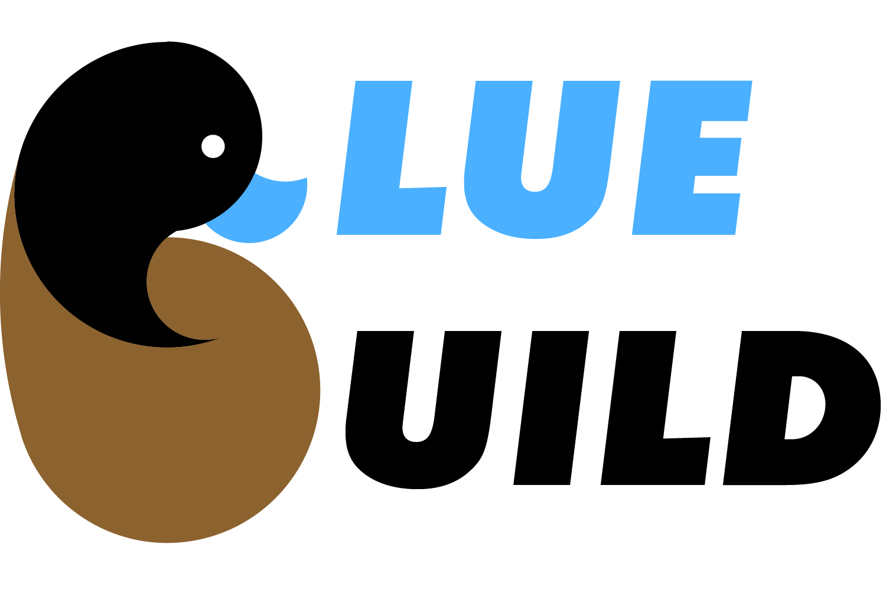

<div align="center">
  <center>
    <figure>
      
      <figcaption>Graphic Designer: Ian Price</figcaption>
    </figure>
  </center>
</div>

# BlueBuild

This is my personal project trying to create a more conise version of the [starting point](https://github.com/ublue-os/startingpoint/tree/template) repo all condensed into a single Rust based CLI tool.

## Installation

### Cargo

This is the best way to install as it gives you the opportunity to bulid for your specific environment.

```bash
cargo install --locked blue-build
```

### Podman/Docker

This will install the binary on your system in `/usr/local/bin`. This is only a `linux-gnu` version.

```bash
podman run --rm registry.gitlab.com/wunker-bunker/blue-build:installer | sudo bash
```

## How to use

### Templating

Once you have the CLI tool installed, you can run the following to pull in your recipe file to generate a `Containerfile`.

```bash
bb template -o <CONTAINERFILE> <RECIPE_FILE>
```

You can then use this with `podman` or `buildah` to build and publish your image. Further options can be viewed by running `bb template --help`

### Building

If you don't care about the details of the template, you can run the `build` command.

```bash
bb build ./config/recipe.yaml
```

This will template out the file and build with `buildah` or `podman`. If you're running in Gitlab CI, it will automatically sign your image using Gitlab's own OIDC service. Here's an example of a `.gitlab-ci.yaml`:

```yaml
workflow:
  rules:
    - if: $CI_COMMIT_BRANCH && $CI_OPEN_MERGE_REQUESTS && $CI_PIPELINE_SOURCE == "push"
      when: never
    - if: "$CI_COMMIT_TAG"
    - if: $CI_PIPELINE_SOURCE == "merge_request_event"
    - if: "$CI_COMMIT_BRANCH && $CI_OPEN_MERGE_REQUESTS"
      when: never
    - if: "$CI_COMMIT_BRANCH"
stages:
  - build
variables:
  ACTION:
    description: "Action to perform for the pipeline."
    value: "build-image"
    options:
      - "build-image"
build-image:
  stage: build
  image: registry.gitlab.com/wunker-bunker/blue-build:alpine
  retry: 2
  rules:
    - if: $ACTION == "build-image"
  parallel:
    matrix:
      - RECIPE:
          - recipe.yml
  id_tokens:
    SIGSTORE_ID_TOKEN:
      aud: sigstore
  script:
    - bb build --push ./config/$RECIPE
```

Support was also added for building in GitHub! You can use this tool instead of the standard GitHub Actions by using the following `.github/workflows/build.yaml`:

```yaml
name: build-ublue
on:
  schedule:
    - cron: "30 16 * * *"
  push:
    branches:
      - live
      - template
      - main
    paths-ignore:
      - "**.md"
  pull_request:
  workflow_dispatch:
jobs:
  ublue-build:
    name: Build Ublue Image
    runs-on: ubuntu-22.04
    permissions:
      contents: read
      packages: write
      id-token: write
    strategy:
      fail-fast: false
      matrix:
        recipe:
          - recipe.yml
    steps:
      - name: Maximize build space
        uses: AdityaGarg8/remove-unwanted-software@v1
        with:
          remove-dotnet: 'true'
          remove-android: 'true'
          remove-haskell: 'true'
      - uses: actions/checkout@v4
      - uses: sigstore/cosign-installer@v3.3.0
      - name: Install Cargo
        run: |
          curl --proto '=https' --tlsv1.2 -sSf https://sh.rustup.rs | sh -s -- -y
      - name: Install BlueBuild tool
        run: |
          cargo install blue-build --locked
      - name: Install Dependencies
        run: |
          sudo apt-get install -y buildah skopeo
      - name: Build Image
        env:
          COSIGN_PRIVATE_KEY: ${{ secrets.SIGNING_SECRET }}
          PR_EVENT_NUMBER: ${{ github.event.number }}
          REGISTRY_TOKEN: ${{ github.token }}
        run: |
          bb build --push ./config/${{ matrix.recipe }}
```

## Future Features

- [x] Update to the most recent stable style of the [starting point](https://github.com/ublue-os/startingpoint/tree/template) template
- [x] Setup pipeline automation for publishing
- [ ] Create an init command to create a repo for you to start out
- [ ] Setup the project to allow installing with `binstall`
- [x] Create an install script for easy install for users without `cargo`
